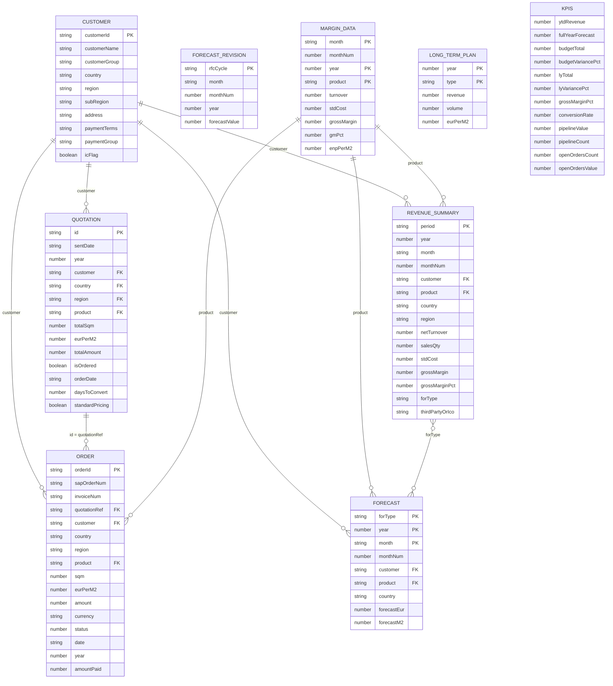
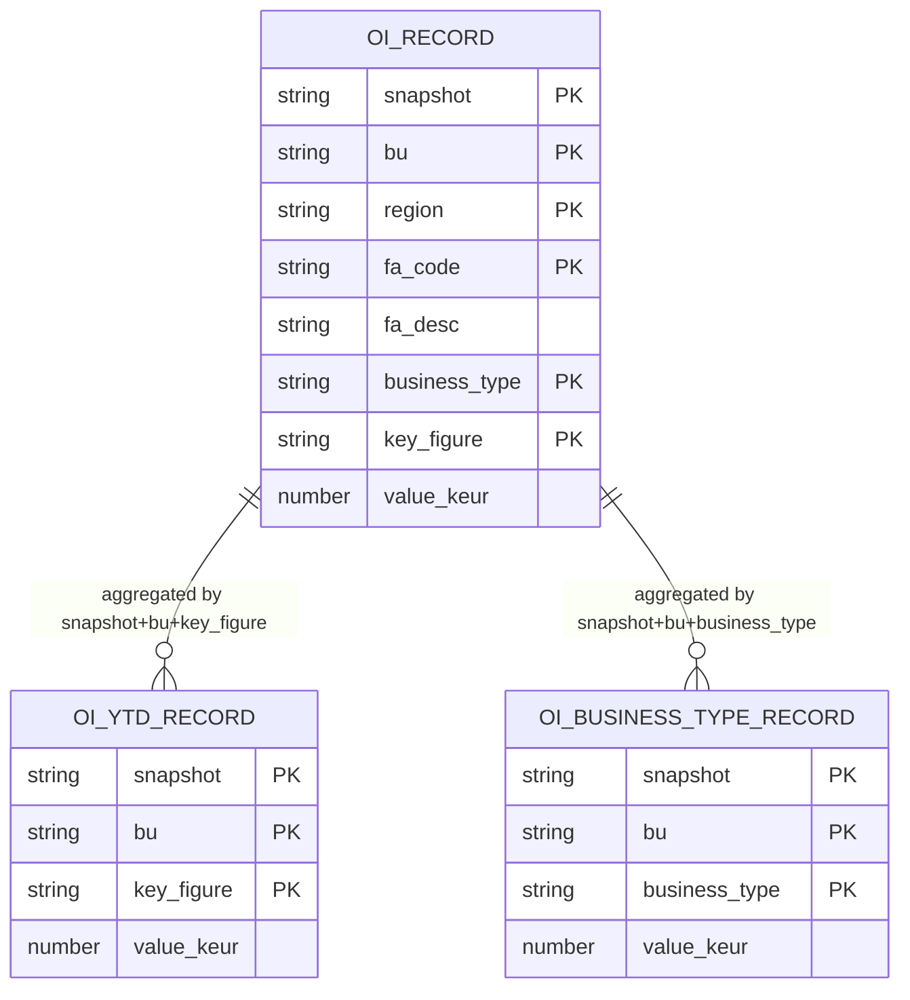
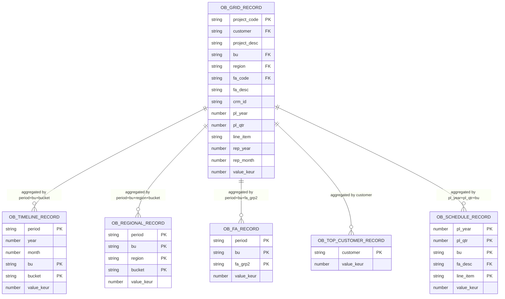
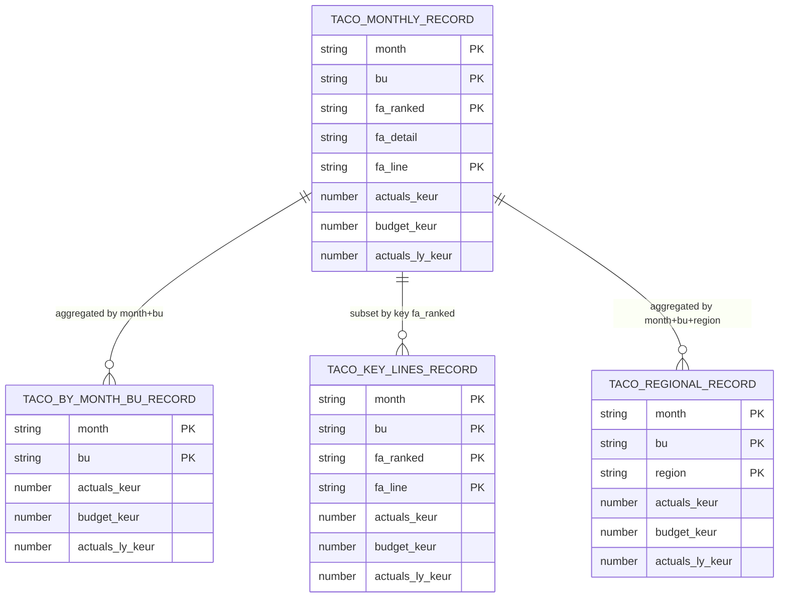
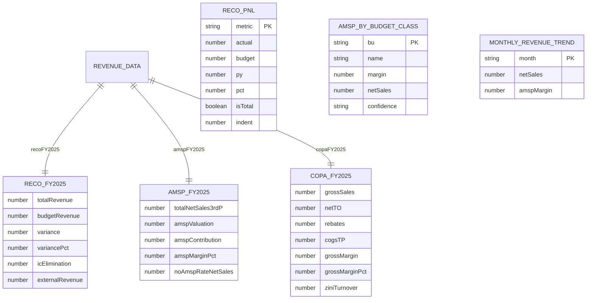

# ER Diagrams — All Dashboards

---

## 1. Digital Radiology (DR)

```mermaid
erDiagram

    DASHBOARD_DATA ||--|| KPIS : contains
    DASHBOARD_DATA ||--o{ OIT_TREND_POINT : "oitTrend[]"
    DASHBOARD_DATA ||--|| PIPELINE_FUNNEL : "pipelineFunnel"
    DASHBOARD_DATA ||--|| EQUIPMENT_MIX : "equipmentMix"
    DASHBOARD_DATA ||--|| REGION_BREAKDOWN : "regionBreakdown"
    DASHBOARD_DATA ||--|| KAM_SCORECARD : "kamScorecard"
    DASHBOARD_DATA ||--o{ FUNNEL_HEALTH_POINT : "funnelHealth[]"
    DASHBOARD_DATA ||--|| WIN_LOSS : "winLoss"
    DASHBOARD_DATA ||--|| FEEDFILE_SUMMARY : "feedfileSummary"
    DASHBOARD_DATA ||--o{ DEALER_TARGET : "dealerTargets[]"

    KPIS {
        string currentWeek
        string lastRefreshed
        number oitYTD2026
        number oitFY2025
        number oitFY2024
        number openPipelineTotal
        number openPipelineCount
        number wonDeals2026
        number rtCY_W12
        number rtBT_W12
        number rtPY_W12
        number plannedRecoCount
        number sapOrderCount
    }

    OIT_TREND_POINT {
        string period PK
        number oitEUR
        number dealCount
    }

    PIPELINE_FUNNEL ||--o{ FUNNEL_SNAPSHOT_ITEM : "snapshot[]"
    PIPELINE_FUNNEL ||--o{ FUNNEL_WEEKLY_POINT : "weeklyTrend[]"

    FUNNEL_SNAPSHOT_ITEM {
        string flag PK
        number sortOrder
        number amountEUR
        number weightedEUR
        number count
    }

    FUNNEL_WEEKLY_POINT {
        string week PK
        number Won
        number IncludedAndSecured
        number Included
        number IncludedWithRisk
        number Upside
        number Pipeline
        number totalOpen
    }

    EQUIPMENT_MIX ||--o{ EQUIPMENT_MIX_ITEM_2026Q1 : "oit2026Q1[]"
    EQUIPMENT_MIX ||--o{ EQUIPMENT_MIX_ITEM_2025FY : "oit2025FY[]"
    EQUIPMENT_MIX ||--o{ EQUIPMENT_MIX_ITEM_2024FY : "oit2024FY[]"

    EQUIPMENT_MIX_ITEM_2026Q1 {
        string type PK
        number eurM
        number deals
    }

    EQUIPMENT_MIX_ITEM_2025FY {
        string type PK
        number eurM
        number deals
    }

    EQUIPMENT_MIX_ITEM_2024FY {
        string type PK
        number eurM
        number deals
    }

    REGION_BREAKDOWN ||--o{ REGION_OIT_ITEM : "oitByRegion2026[] / oitByRegion2025[]"
    REGION_BREAKDOWN ||--o{ REGION_PIPELINE_ITEM : "pipelineW12[]"

    REGION_OIT_ITEM {
        string region PK
        number eurM
        number deals
    }

    REGION_PIPELINE_ITEM {
        string region FK
        number wonEUR
        number committedEUR
        number upsideEUR
    }

    KAM_SCORECARD ||--o{ KAM_DATA : "kams[]"

    KAM_DATA {
        string name PK
        string region FK
        number w12Amount
        number w12Weighted
        string flagW12
    }

    FUNNEL_HEALTH_POINT {
        number week PK
        string label
        number rtCY
        number rtBT
        number rtPY
        number rtFC
        number weeklyCY
    }

    WIN_LOSS ||--|| WIN_LOSS_OVERALL : "overall"
    WIN_LOSS ||--o{ WIN_LOSS_BY_REGION : "byRegion[]"
    WIN_LOSS ||--o{ WIN_LOSS_BY_EQUIPMENT : "byEquipment[]"
    WIN_LOSS ||--o{ WIN_LOSS_BY_SIZE : "byDealSize[]"
    WIN_LOSS ||--o{ WIN_LOSS_QUARTER : "closedByQuarter[]"

    WIN_LOSS_OVERALL {
        number won
        number lost
        number open
        number winRate
    }

    WIN_LOSS_BY_REGION {
        string region FK
        number won
        number lost
        number winRate
    }

    WIN_LOSS_BY_EQUIPMENT {
        string equipment FK
        number won
        number lost
        number winRate
    }

    WIN_LOSS_BY_SIZE {
        string band PK
        number won
        number lost
        number winRate
    }

    WIN_LOSS_QUARTER {
        string period PK
        number won
        number wonEUR
        number lost
    }

    FEEDFILE_SUMMARY ||--o{ FEEDFILE_REVENUE_BY_YEAR : "revenueByYear[]"
    FEEDFILE_SUMMARY ||--o{ FEEDFILE_REVENUE_BY_YEAR_TYPE : "revenueByYearAndType[]"
    FEEDFILE_SUMMARY ||--o{ FEEDFILE_DEALER : "topDealers[]"
    FEEDFILE_SUMMARY ||--o{ FEEDFILE_CHANNEL_MIX : "channelMix[]"

    FEEDFILE_REVENUE_BY_YEAR {
        number year PK
        number eurM
    }

    FEEDFILE_REVENUE_BY_YEAR_TYPE {
        number year PK
        string type PK
        number eurM
    }

    FEEDFILE_DEALER {
        string sapId PK
        string name
        number eurM
    }

    FEEDFILE_CHANNEL_MIX {
        string channel PK
        number year PK
        number eurM
    }

    DEALER_TARGET {
        string dealerSapId FK
        string dealerMarket
        number targetYear
        number targetQ1
        number targetQ2
        number targetQ3
        number targetQ4
        number actualEUR
        number forecastEUR
    }

    REGION_OIT_ITEM ||--o{ KAM_DATA : "region"
    REGION_OIT_ITEM ||--o{ WIN_LOSS_BY_REGION : "region"
    REGION_OIT_ITEM ||--|| REGION_PIPELINE_ITEM : "region"
    EQUIPMENT_MIX_ITEM_2026Q1 ||--o{ WIN_LOSS_BY_EQUIPMENT : "type = equipment"
    FEEDFILE_DEALER ||--o{ DEALER_TARGET : "sapId = dealerSapId"
    FUNNEL_SNAPSHOT_ITEM ||--|| FUNNEL_WEEKLY_POINT : "flag maps to column keys"
```

### Source Mapping — DR

| Entity | Original Source File | System | JSON / CSV fed to dashboard |
|---|---|---|---|
| `KPIS` | `msd data.csv` + `T funnel health.csv` | D365 CRM + CRM report | `kpis.json` (computed) |
| `OIT_TREND_POINT` | `msd data.csv` | D365 CRM — Won opps grouped by period | Derived |
| `FUNNEL_SNAPSHOT_ITEM` | `DataWeek.csv` | D365 CRM weekly snapshot | `pipeline.json` |
| `FUNNEL_WEEKLY_POINT` | `T funnel evolution tracker.csv` | D365 CRM weekly flag history | `pipeline.json` |
| `EQUIPMENT_MIX_ITEM_*` | `msd data.csv` / `opportunity.csv` | D365 CRM — `agfa_equipmenttype` field | Derived |
| `REGION_OIT_ITEM` | `msd data.csv` | D365 CRM — `agfa_region` field on Won opps | Derived |
| `REGION_PIPELINE_ITEM` | `DataWeek.csv` | D365 CRM weekly snapshot by region | Derived |
| `KAM_DATA` | `DataWeek.csv` + `msd data.csv` | D365 CRM — `ownerid` / KAM assignment | Derived |
| `FUNNEL_HEALTH_POINT` | `T funnel health.csv` | D365 CRM running total report | `funnelHealth.json` |
| `WIN_LOSS_*` | `opportunity.csv` | D365 CRM — `statecodename` (Won / Lost / Open) | Derived |
| `FEEDFILE_REVENUE_*` | `FeedFile.csv` | SAP AP5 — goods revenue by year & type | `feedfile.json` |
| `FEEDFILE_DEALER` | `FeedFile.csv` | SAP AP5 — revenue by dealer SAP ID | `feedfile.json` |
| `FEEDFILE_CHANNEL_MIX` | `FeedFile.csv` | SAP AP5 — direct vs indirect channel split | `feedfile.json` |
| `DEALER_TARGET` | `FeedFile.csv` + `DealerList_TargetSetting.csv` | SAP AP5 actuals + manual target file | `dealerTargets.json` |

> **CRM spec:** field definitions in `CRM data in Radiology reporting.xlsx` (48 opportunity fields, 100+ product fields, 271-row region mapping).
> **SAP BW spec:** query parameters in `BW data in prize realisation.xlsx` (AP5 = BP5 sheet, AP2 = BP2 sheet).

---

## 2. Digital Hydrogen (DH)

### Source Mapping — DH

| Entity | Original Source File | Sheet / Tab | JSON fed to dashboard |
|---|---|---|---|
| `CUSTOMER` | `Master data _Customers overview Zirfon.xlsx` | Customer info | `customers.json` |
| `QUOTATION` | `Overview quotes GHS.xlsx` | 5657-8081, 5638, pivot | `quotations.json` |
| `ORDER` | `Sales zirfon GHS.xlsx` + `AP1 SAP extract on sales orders 2026.xlsx` | 2023–2026 annual tabs + Blad1 | `orders.json` |
| `REVENUE_SUMMARY` | `FY 2025.xls` (SAP BW) | BI Report Mortsel / Aspac / Turnover Analysis | `revenue_summary.json` |
| `FORECAST` | `Sales Forecast February2026.xlsx` + `ACTFY2025_Forecasting file.xlsx` | FOR Summary, Committed volumes by Customer | `forecast.json` |
| `FORECAST_REVISION` | `ACTFY2025_Forecasting file.xlsx` | FOR vs previous FOR | `forecast_revisions.json` |
| `MARGIN_DATA` | `FY 2025.xls` (SAP BW) | Mapping Standard Costprices, Month Margin, Full Pivot Margin | `margin_data.json` |
| `LONG_TERM_PLAN` | `Sales Forecast February2026.xlsx` | Revenue overview | `long_term_plans.json` |
| `KPIS` | Computed from all above | — | `kpis.json` |

> **Central hub:** `Sales zirfon GHS.xlsx` is the master order file — 920 rows across 4 annual sheets. `AP1 SAP extract` adds 46 YTD 2026 orders with delivery/confirmation data not present in GHS.
> **SAP BW workbook:** `FY 2025.xls` contains `BExRepositorySheet` — it is a live SAP BW query export from system AP1, not a manually maintained file.

---

## 3. HE IT

> Three independent domains linked by shared dimensions: `bu` and `region`.

### Domain 1 — Order Intake (OI)

**Source:** `OI HEC view pivot table (1).xlsx` — 15 sheets from Access DB (13 monthly snapshots). Key sheets: `Pivot` (raw), `S1 Regional`, `OI per Business Type`, `OI BUD26 per Bus Type`.

| Entity | Sheet(s) used | JSON |
|---|---|---|
| `OI_RECORD` | `Pivot` (all key figures × region × FA code) | `oi_monthly.json` |
| `OI_YTD_RECORD` | `Pivot` — YTD ACT / YTD BUD / YTD LY key figures | `oi_ytd.json` |
| `OI_BUSINESS_TYPE_RECORD` | `OI per Business Type`, `S1 Bus Type Pivot` | `oi_business_type.json` |

### Domain 2 — Order Book (OB)

**Sources:** Two files from the same Access DB.

| Entity | Source File | Sheet(s) | JSON |
|---|---|---|---|
| `OB_GRID_RECORD` | `Order Book detailed pivot.xlsm` | Sheet1 / Sheet2 — project-level rows, 39 cols, full EUR, CRM IDs | `ob_grid.json` |
| `OB_TIMELINE_RECORD` | `7.14 Order Book Overview pivot (BRM HQ views).xlsx` | `Total OB evo` | `ob_timeline.json` |
| `OB_REGIONAL_RECORD` | `7.14 Order Book Overview pivot (BRM HQ views).xlsx` | `S1 per region`, `S2 per region`, `S4 per region`, `H1 per Region` | `ob_regional.json` |
| `OB_FA_RECORD` | `7.14 Order Book Overview pivot (BRM HQ views).xlsx` | `IT per RevStr`, `IT per RevStr Grp` | `ob_fa.json` |
| `OB_TOP_CUSTOMER_RECORD` | `7.14 Order Book Overview pivot (BRM HQ views).xlsx` | `Default pivot` | `ob_top_customer.json` |
| `OB_SCHEDULE_RECORD` | `7.14 Order Book Overview pivot (BRM HQ views).xlsx` | `S1 OB EI`, `S1 OB EI per region` | `ob_schedule.json` |

> `7.14 Order Book Overview pivot` has `BExRepositorySheet` — it is a SAP BW export. The `.xlsm` has VBA macros to refresh data from the Access DB.

### Domain 3 — TACO (P&L)

**Source:** `20-TACO pivot 2025 Selectable x-rate.xlsm` — 4 sheets from Access DB. Selectable FX rate; 80+ company codes; actuals vs budget vs prior year.

| Entity | Sheet(s) used | JSON |
|---|---|---|
| `TACO_MONTHLY_RECORD` | `Pivot` (full detail: month × bu × fa_ranked × fa_line) | `taco_monthly.json` |
| `TACO_BY_MONTH_BU_RECORD` | `Dashboard EUR` (summary roll-up) | Derived from `taco_monthly.json` |
| `TACO_KEY_LINES_RECORD` | `Pivot` — filtered to key `fa_ranked` values (Lines 02, 07, 09, 11, 26, 55, 63, 85) | `taco_key_lines.json` |
| `TACO_REGIONAL_RECORD` | `Report view` / `Source Report view` — region dimension | `taco_regional.json` |

### Cross-Domain Links (HE IT)

| Dimension | OI | OB | TACO |
|-----------|----|----|------|
| `bu` | `OIRecord.bu` | `OBGridRecord.bu` | `TacoMonthlyRecord.bu` |
| `region` | `OIRecord.region` | `OBRegionalRecord.region` | `TacoRegionalRecord.region` |
| `fa_code` | `OIRecord.fa_code` | `OBGridRecord.fa_code` | — |
| `fa_desc` | `OIRecord.fa_desc` | `OBGridRecord.fa_desc`, `OBScheduleRecord.fa_desc` | `TacoMonthlyRecord.fa_detail` |
| `period/snapshot` | `OIRecord.snapshot` | `OBTimelineRecord.period` | `TacoMonthlyRecord.month` |

---

## 4. DPS

> DPS uses **hardcoded static constants** — no entity relationships, no FK keys. Flat denormalized data only.

> **Note:** `AMSP_BY_BUDGET_CLASS.bu` and `RECO_PNL.metric` are standalone lookups with no FK relationships to other entities. DPS is a candidate for refactoring into a proper relational model when live data is connected.

### Source Mapping — DPS

All DPS entities are **hardcoded constants** in `dpsData.ts` — manually extracted from the SAP BW exports below. No live query connection exists yet.

| Entity | Source File | SAP System | What it contains |
|---|---|---|---|
| `RECO_FY2025` | `DPS_BP1_RECO Analysis Final.xls` | SAP BW (BExRepositorySheet + Table) | Top-level P&L summary: total revenue, budget, IC elimination, external revenue |
| `RECO_PNL` | `DPS_BP1_RECO Analysis Final.xls` | SAP BW — KRECO20 query | Full P&L waterfall row-by-row: Revenue → Mfg Contribution → Gross Margin → SG&A → Adj EBIT → EBIT |
| `AMSP_FY2025` | `DPS_BP1 - AMSP Contribution Check (Final).xls` | SAP BW | AMSP valuation, contribution, margin %, net sales 3rd party, no-AMSP-rate coverage |
| `AMSP_BY_BUDGET_CLASS` | `DPS_BP1 - AMSP Contribution Check (Final).xls` | SAP BW | Margin & net sales by budget class / BU (Anapurna, INCA, Jeti, Oberon, Onset, Speedset) |
| `COPA_FY2025` | `DPS_BP1 - Sales details in all currencies.xls` | SAP BW — CO-PA | Gross sales, net TO, rebates, COGS transfer price, gross margin, ZINI turnover |
| `MONTHLY_REVENUE_TREND` | `DPS_BP1 - AMSP Contribution Check (Final).xls` | SAP BW | Monthly net sales & AMSP margin Jan–Dec 2025 |

> **Order Intake data** (`DPS_Customer order & revenue follow-up 2026.xlsx`, 62 sheets) is tracked separately as unit counts only — no EUR values. It links to the above SAP BW files only through the equipment family dimension, not via a direct key.
